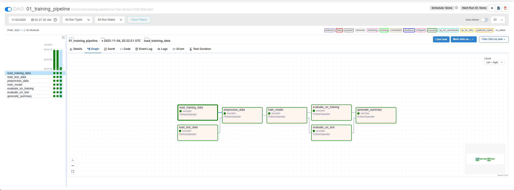
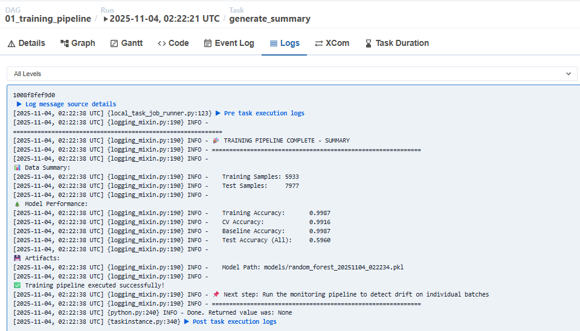
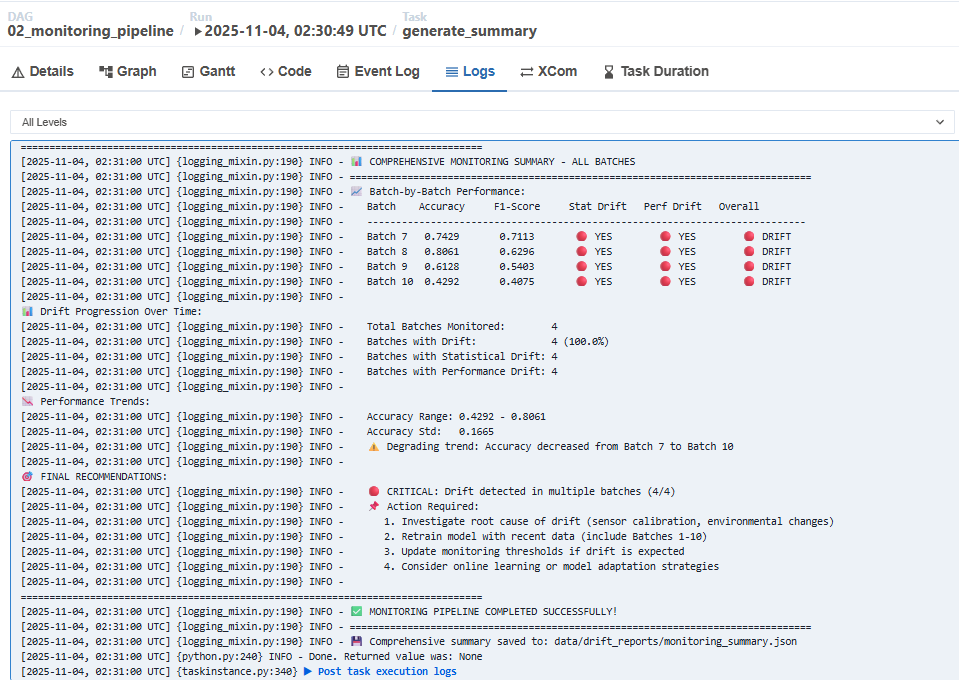

# Airflow Lab-1: Gas Sensor Drift Detection - Pipeline with Apache Airflow

## Project Overview

This project implements an end-to-end pipeline for detecting drift in gas sensor data using Apache Airflow. The system trains a `Random Forest classifier` on [historical gas sensor readings](https://archive.ics.uci.edu/dataset/224/gas+sensor+array+drift+dataset) and monitors for `data drift` and `performance degradation` over time.

### Key Features

- **Automated Training Pipeline**: Loads, preprocesses, trains, and evaluates the `Random Forest classifier`
- **Drift Detection Pipeline**: Monitors model performance and detects `statistical drift` across multiple batches of data
- **Statistical Analysis**: Uses `KS test`, `PSI (Population Stability Index)`, and `Wasserstein distance`
- **Dockerized Environment**: Full `Docker Compose` setup for easy deployment
- **Airflow Orchestration**: Two DAGs managing `training` and `monitoring` workflows

---

## Project Structure

```
airflow_lab1/
├── dags/
│   ├── 01_training_pipeline.py       # Training workflow DAG
│   └── 02_monitoring_pipeline.py     # Drift monitoring DAG
├── src/
│   ├── data/
│   │   ├── data_loader.py            # Data loading utilities
│   │   └── preprocess.py             # Preprocessing pipeline
│   ├── models/
│   │   ├── train.py                  # Model training
│   │   └── evaluate.py               # Model evaluation
│   └── drift/
│       ├── statistical_test.py       # Statistical drift detection
│       └── performance_monitor.py    # Performance monitoring
├── config/
│   └── config.yaml                   # Configuration file
├── data/
│   ├── raw/                          # Raw sensor data (batches 1-10)
│   ├── processed/                    # Processed datasets
│   └── drift_reports/                # Drift analysis reports
├── models/                           # Trained model artifacts
├── docker-compose.yaml               # Docker orchestration
├── Dockerfile                        # Custom Airflow image
├── .env                              # Environment variables
├── start-airflow.ps1                 # Windows startup script
├── stop-airflow.ps1                  # Windows shutdown script
└── README.md                         # This file
```

---

## Prerequisites

- **Docker Desktop** (Windows/Mac) or Docker Engine (Linux)
- **Docker Compose** v2.0+
- **PowerShell** (for Windows users)
- At least **4GB RAM** and **10GB disk space**

---

## Setup Instructions

### 1. Clone the Repository

```bash
cd airflow_lab1
```

### 2. Environment Configuration

The `.env` file is already configured with:
```env
AIRFLOW_UID=50000
AIRFLOW_PROJ_DIR=.
_AIRFLOW_WWW_USER_USERNAME=admin
_AIRFLOW_WWW_USER_PASSWORD=admin
```

### 3. Start Airflow

#### Windows (PowerShell)
```powershell
.\start-airflow.ps1
```

#### Linux/Mac
```bash
# Build custom image
docker-compose build

# Initialize Airflow database
docker-compose up airflow-init

# Start services
docker-compose up -d
```

### 4. Access Airflow Web UI

1. Open browser: http://localhost:8080
2. Login credentials:
   - **Username**: `admin`
   - **Password**: `admin`

### 5. Stop Airflow

#### Windows (PowerShell)
```powershell
.\stop-airflow.ps1
```
or
```terminal
docker-compose down
```
#### Linux/Mac
```bash
docker-compose down
```

To remove all data including database:
```bash
docker-compose down -v
```

---

## Pipeline Workflows

### 1. Training Pipeline (`01_training_pipeline`)

**Purpose**: Train the initial model on historical data (batches 1-6) and establish baseline metrics.

**Workflow Steps**:
```
Load Training Data (Batches 1-6)     Load Test Data (Batches 7-10)
                     └────────────┬────────────┘
                                  |
                                  |
                            Preprocess Data
                                  |
                                  |
                            Train Model
                                  |
                                  |
                           ┌──────┴──────┐
                           │             │
                        Evaluate on    Evaluate on
                        Training Data  Test Data
                           │             │
                           └──────┬──────┘
                                  |
                                  |
                         Generate Summary
```

**Tasks**:
1. **load_training_data**: Loads batches 1-6 for training
2. **load_test_data**: Loads batches 7-10 for testing
3. **preprocess_data**: Scales features using StandardScaler
4. **train_model**: Trains Random Forest with cross-validation
5. **evaluate_on_training**: Establishes baseline metrics
6. **evaluate_on_test**: Tests on unseen data
7. **generate_summary**: Creates performance report

**Outputs**:
- Trained model: `models/random_forest_model.pkl`
- Scaler: `models/scaler.pkl`
- Metrics: `data/drift_reports/baseline_metrics.json`

### 2. Monitoring Pipeline (`02_monitoring_pipeline`)

**Purpose**: Monitor individual test batches for drift and performance degradation.

**Workflow Steps** (per batch):
```
Load Batch Data
      |
  Load Model
      |
  Scale Data
      |
Evaluate Performance
      |
  Detect Drift
      |
Monitor Performance
      |
Save Reports
      |
Generate Summary
```

**Dynamic Tasks**: Creates parallel tasks for batches 7, 8, 9, and 10
- `monitor_batch_7`
- `monitor_batch_8`
- `monitor_batch_9`
- `monitor_batch_10`

**Drift Detection Methods**:
- **KS Test**: Kolmogorov-Smirnov test for distribution changes
- **PSI**: Population Stability Index
- **Wasserstein Distance**: Earth Mover's Distance

**Outputs** (per batch):
- Drift reports: `data/drift_reports/drift_report_batch{X}_{timestamp}.json`
- Performance reports: `data/drift_reports/performance_report_batch{X}_{timestamp}.json`

---

## Airflow UI Visualization

### Triggering DAGs

#### Manual Trigger (Recommended)
1. Go to **DAGs** page
2. Click the **play button** (▶) on the right side of the DAG name
3. Confirm trigger

#### Sequence for First Run
1. **First**: Run `01_training_pipeline` to train the model
2. **Wait**: Until all tasks show green (success)
3. **Then**: Run `02_monitoring_pipeline` to detect drift

### DAG Graph View

#### Training Pipeline
1. Navigate to **DAGs** tab
2. Click on `01_training_pipeline`
3. Click **Graph** button

You'll see:
- **Parallel data loading** (training and test data)
- **Sequential preprocessing and training**
- **Parallel evaluation** (baseline and test)
- **Final summary generation**



#### Monitoring Pipeline
1. Navigate to **DAGs** tab
2. Click on `02_monitoring_pipeline`
3. Click **Graph** button

You'll see:
- **Four parallel monitoring tasks** (one per batch)
- Each task runs the complete drift detection workflow


### Viewing Task Logs

1. Click on any **task** in the Graph view
2. Click **Log** button
3. View detailed execution logs with:
   - Data shapes and statistics
   - Model performance metrics
   - Drift detection results
   - Error messages (if any)
---

## Understanding the Results

### Training Pipeline Metrics

Located in task logs of `generate_summary`:

```
📊 Data Summary:
   Training Samples: ~XXXXX
   Test Samples:     ~XXXXX

🌲 Model Performance:
   Training Accuracy:       0.XXXX
   CV Accuracy:             0.XXXX
   Baseline Accuracy:       0.XXXX
   Test Accuracy (All):     0.XXXX
```


### Drift Detection Results

Located in `data/drift_reports/drift_report_batch{X}_{timestamp}.json`:

```json
{
  "batch_id": 7,
  "timestamp": "2025-11-03T...",
  "overall_drift_detected": true/false,
  "features_with_drift": [...],
  "ks_test_results": {...},
  "psi_results": {...},
  "wasserstein_results": {...}
}
```

**Drift Thresholds**:
- **KS Test p-value**: < 0.05 indicates drift
- **PSI**: > 0.1 indicates drift
- **Wasserstein**: Higher values indicate more drift

### Performance Reports

Located in `data/drift_reports/performance_report_batch{X}_{timestamp}.json`:

```json
{
  "batch_id": 7,
  "metrics": {
    "accuracy": 0.XXXX,
    "f1_macro": 0.XXXX,
    ...
  },
  "performance_degradation_detected": true/false,
  "accuracy_drop": 0.XXX
}
```

### Monitoring Pipeline Summary

Located in task logs of `generate_summary`:



---

## Configuration

### Modify Training/Test Split

Edit `config/config.yaml`:

```yaml
data:
  train_batches: [1, 2, 3, 4, 5, 6]
  test_batches: [7, 8, 9, 10]
```

### Adjust Drift Thresholds

Edit `config/config.yaml`:

```yaml
drift_thresholds:
  ks_test_pvalue: 0.05
  psi_threshold: 0.1
  wasserstein_threshold: 0.5
```

### Model Hyperparameters

Edit `config/config.yaml`:

```yaml
model:
  n_estimators: 100
  max_depth: 20
  min_samples_split: 5
  random_state: 42
```

---

## Data Flow Diagram

```
Raw Data (Batches 1-10)
         |
         v
  Training Pipeline
         |
    ├─ Load Data
    ├─ Preprocess
    ├─ Train Model ──> Saved Model
    └─ Evaluate    ──> Baseline Metrics
         |
         v
  Monitoring Pipeline
         |
    ├─ Load Batch
    ├─ Scale with Saved Scaler
    ├─ Predict with Saved Model
    ├─ Detect Drift ──> Drift Reports
    └─ Monitor Performance ──> Performance Reports
```

---

## Technologies Used

- **Apache Airflow 2.10.4**: Workflow orchestration
- **Python 3.11**: Programming language
- **Docker & Docker Compose**: Containerization
- **PostgreSQL 13**: Airflow metadata database
- **scikit-learn**: Machine learning
- **pandas**: Data manipulation
- **scipy**: Statistical tests
- **PyYAML**: Configuration management

---

## Project Owner

- **Name**: Hariharan Chandrasekar
- **NUID**: 002312867
- **Course**: MLOps - Term 3
- **Lab Assignment**: Airflow Lab 1

---

## License

This project is for educational purposes as part of the MLOps course curriculum.

---

**Happy MLOps! 🚀**
